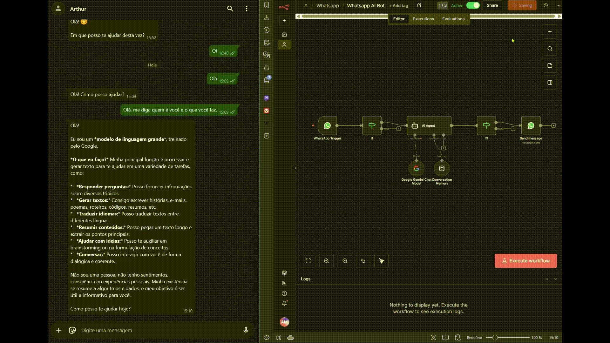

# Bot de WhatsApp com IA (Gemini) via n8n

Este projeto contém um fluxo de automação para o **n8n** que cria um assistente virtual no WhatsApp utilizando a inteligência artificial do **Google Gemini**.

## 📝 Descrição

O fluxo integra o WhatsApp com o Google Gemini para processar mensagens recebidas e gerar respostas inteligentes e contextuais. O sistema utiliza memória de conversação para manter o contexto do diálogo, permitindo interações mais naturais.

## 🚀 Funcionalidades

- **Recebimento de Mensagens**: Gatilho automático via webhook do WhatsApp.
- **Processamento com IA**: Utiliza o modelo `Google Gemini Chat` para interpretar e responder.
- **Memória de Conversação**: O bot "lembra" das mensagens anteriores para manter o contexto.
- **Resposta Automática**: Envia a resposta gerada pela IA de volta para o usuário no WhatsApp.

## 🎥 Demonstração

## 🛠️ Como Funciona o Fluxo

1. **WhatsApp Trigger**: Inicia quando uma mensagem é enviada para o número conectado.
2. **If (Validação)**: Verifica a existência de mensagens válidas.
3. **AI Agent**: O núcleo do fluxo. Recebe o texto, consulta a memória e o modelo Gemini para gerar uma resposta.
4. **Send Message**: Envia a resposta final para o WhatsApp do usuário.

## 📋 Pré-requisitos

Para utilizar este fluxo, você precisará de:

- Uma instância do [n8n](https://n8n.io/) instalada.
- Credenciais da API do **WhatsApp Business** (Meta).
- Credenciais da API do **Google Gemini**.
