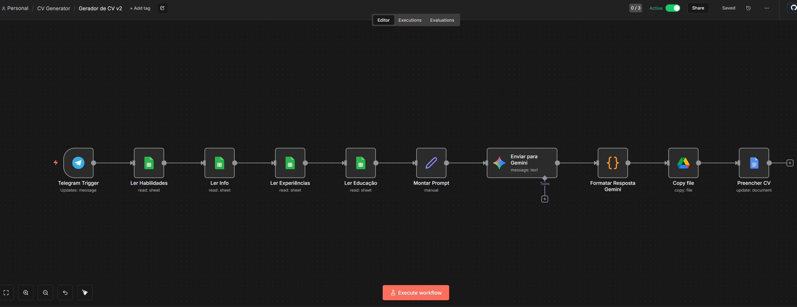
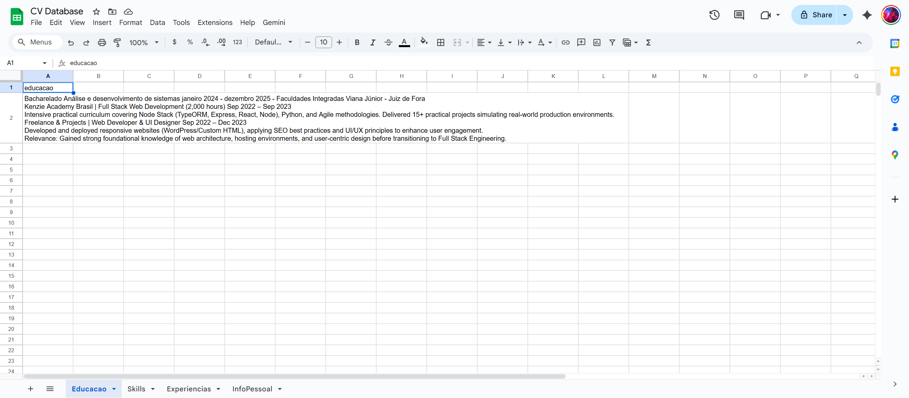
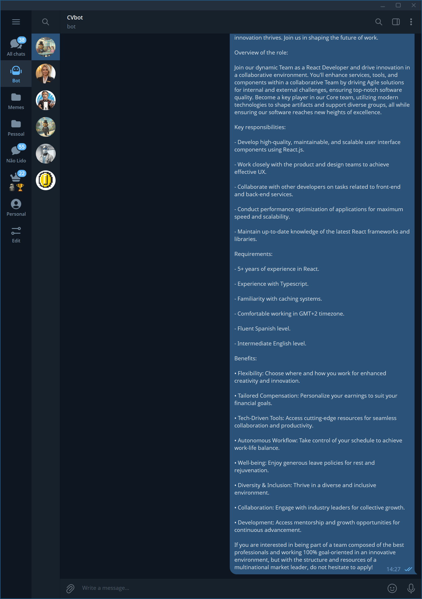
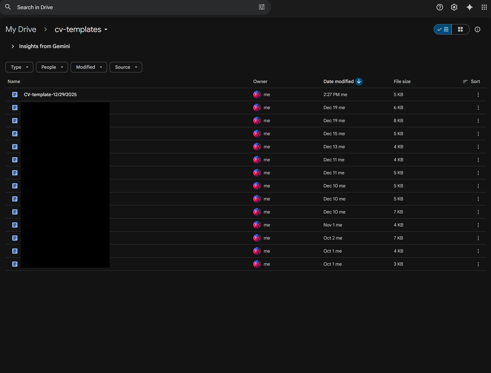
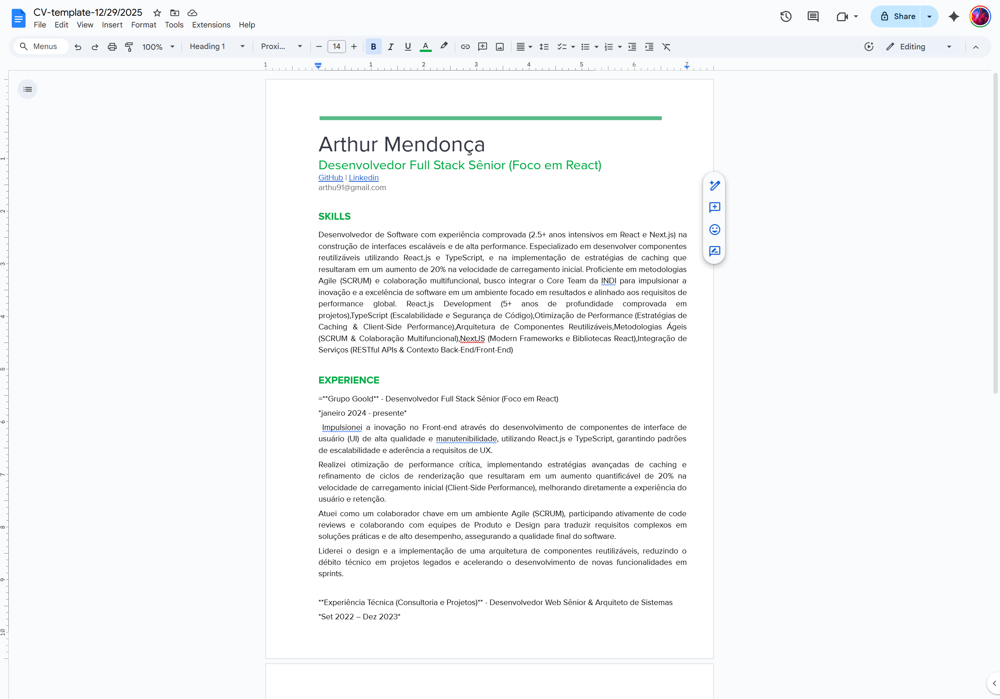

# Gerador de Currículos Personalizados com IA (Gemini) via n8n

Este projeto é uma automação inteligente construída no **n8n** que cria currículos personalizados e otimizados para vagas específicas. O sistema cruza seus dados profissionais (armazenados em uma planilha) com a descrição de uma vaga enviada pelo **Telegram**, utilizando o **Google Gemini** para reescrever e adaptar o conteúdo.

## 📝 Descrição

Cansado de editar seu currículo para cada vaga que aplica? Este fluxo automatiza o processo:
1. Você mantém seu "Currículo Base" em uma planilha do Google Sheets.
2. Ao encontrar uma vaga, você envia a descrição dela para o bot no Telegram.
3. A IA analisa a vaga e seus dados, gerando um novo documento Google Docs com um currículo 100% focado naquela oportunidade.

## 🚀 Funcionalidades

- **Base de Dados Centralizada**: Seus dados (experiência, educação, skills) ficam organizados no Google Sheets.
- **Adaptação Inteligente (Gemini)**:
  - Reescreve o resumo profissional para conectar com a vaga.
  - Destaca as habilidades mais relevantes exigidas.
  - Adapta a descrição das experiências para enfatizar resultados pertinentes.
- **Geração Automática de Documentos**: Cria um novo Google Doc para cada aplicação, mantendo o layout original do seu modelo.

## 🎥 Como Funciona

### 1. Visão Geral do Fluxo
O fluxo no n8n orquestra a leitura dos dados, o processamento pela IA e a criação do documento.

### 2. Base de Dados (Google Sheets)
Todas as suas informações profissionais são lidas de abas separadas (Info Pessoal, Experiências, Educação, Skills).

### 3. Solicitando um Novo CV (Telegram)
Basta enviar a descrição da vaga para o bot.

### 4. Geração do Arquivo
O sistema copia um template e preenche com os dados gerados pela IA.

### 5. Resultado Final
Um currículo pronto, formatado e customizado para a vaga.

## 🛠️ Detalhes Técnicos do Fluxo

1. **Telegram Trigger**: Inicia o fluxo ao receber o texto da vaga.
2. **Google Sheets Nodes**: 4 nós de leitura buscam todas as informações do candidato.
3. **Google Gemini**: Recebe o prompt com os dados + vaga e retorna um JSON estruturado com o conteúdo reescrito.
4. **Code Node**: Formata e valida a resposta da IA.
5. **Google Drive**: Copia o arquivo de template padrão.
6. **Google Docs**: Substitui as variáveis (ex: `((resumo))`, `((experiencia))`) pelo texto gerado.

## 📋 Pré-requisitos

- **n8n** instalado e rodando.
- Conta no **Google Cloud Platform** com APIs habilitadas (Drive, Docs, Sheets, Gemini).
- **Bot no Telegram** configurado.
- Uma **Planilha Google** estruturada com seus dados.
- Um **Documento Google** servindo de template com os placeholders corretos.
