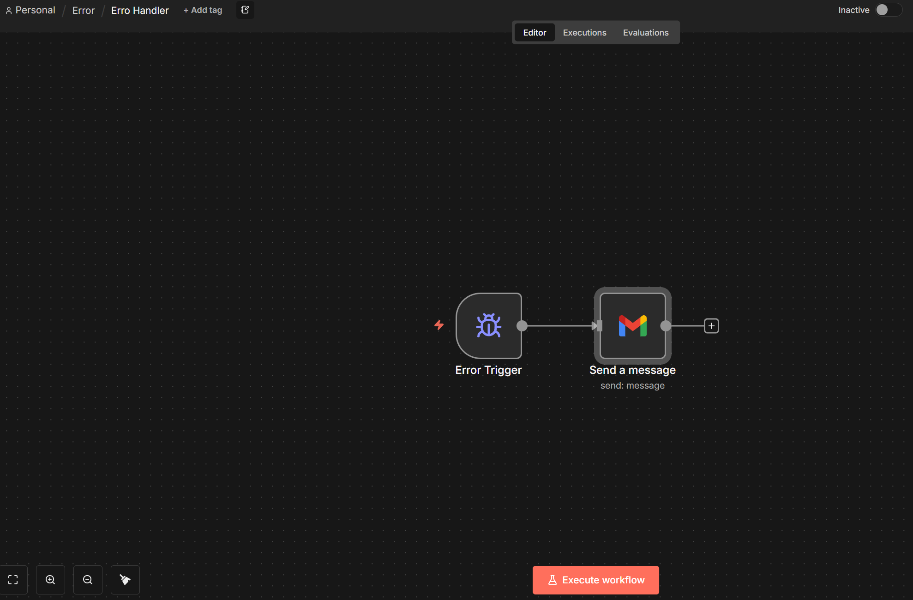

# Fluxo de Tratamento de Erros (Error Handler)

Este fluxo funciona como um **monitor de falhas** para suas automações no n8n. Sempre que um erro ocorrer em qualquer outro fluxo configurado para usar este *Error Workflow*, ele será acionado automaticamente para notificar o administrador.

## 📝 Descrição

Em ambientes de produção, é crítico saber imediatamente quando e por que uma automação falhou. Este fluxo captura os detalhes do erro (qual nó falhou, mensagem de erro, link para execução) e envia um alerta imediato por e-mail.

## 🚀 Funcionalidades

- **Captura Automática**: Recebe metadados completos sobre a falha (Workflow ID, Node Name, Error Message).
- **Notificação via Gmail**: Envia um e-mail formatado para o responsável técnico.
- **Link Direto**: O e-mail contém o link para abrir a execução exata que falhou, agilizando o debug.

## 🎥 Visualização do Fluxo

## 🛠️ Como Funciona

1. **Error Trigger**: Este nó especial inicia a execução apenas quando chamado como um *Error Workflow* por outra automação.
2. **Send a Message (Gmail)**: Utiliza os dados recebidos pelo trigger para compor e enviar o alerta.
   - **Assunto**: `N8N - erro no workflow [Nome do Workflow]`
   - **Corpo**:
     - Nó que falhou.
     - Mensagem de erro detalhada.
     - URL direta para inspeção no n8n.

## 📋 Como Configurar

1. Importe este fluxo (`error.json`) para o seu n8n.
2. Configure suas credenciais do **Gmail**.
3. Em **cada fluxo principal** que você deseja monitorar:
   - Vá em `Workflow Settings` (Configurações do Fluxo).
   - Procure a opção **Error Workflow**.
   - Selecione este fluxo ("Erro Handler") na lista.

A partir de agora, qualquer falha nos fluxos principais disparará este alerta automaticamente.
