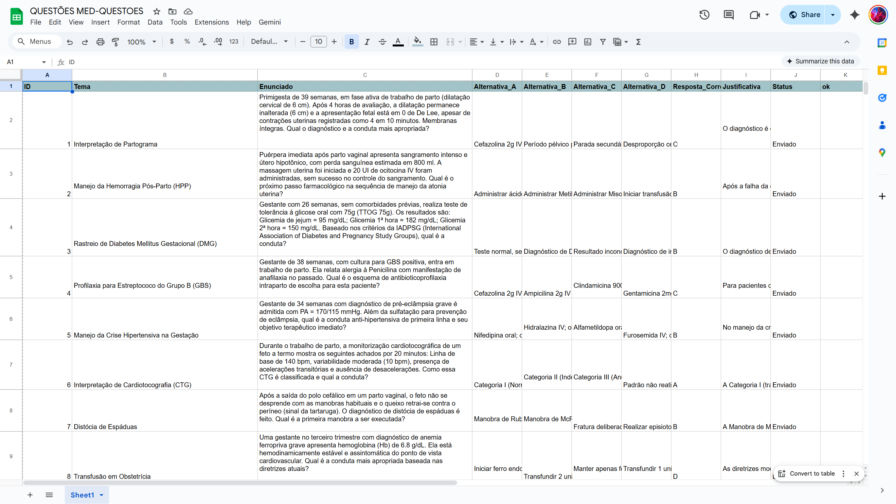
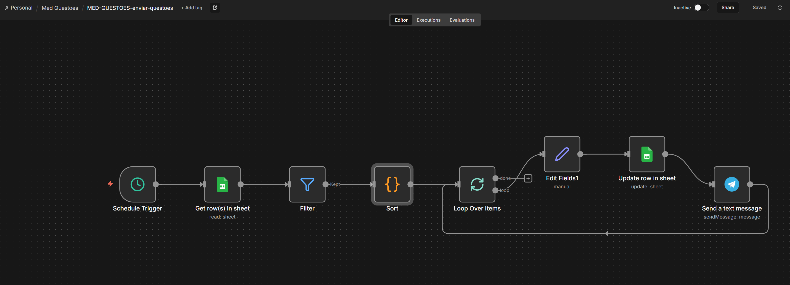
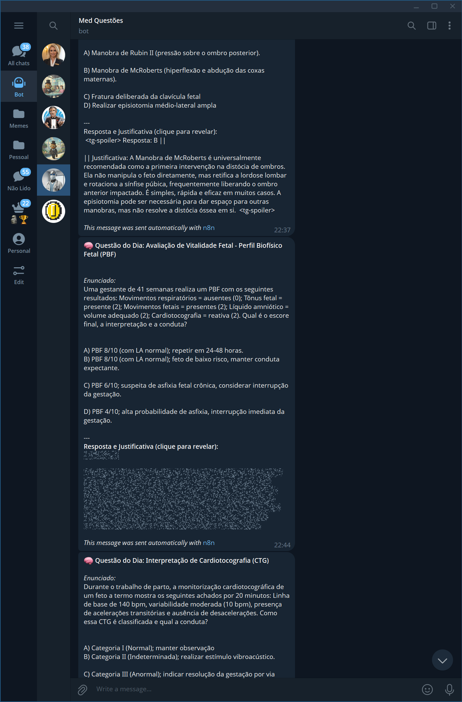

# Gerador de Questões de Medicina com IA (Gemini)

Este projeto implementa uma automação completa no **n8n** para gerar, armazenar e distribuir questões de residência médica de alto nível. Utilizando a inteligência artificial do **Google Gemini**, o sistema cria questões inéditas e as envia como quizzes interativos no **Telegram**.

## 📝 Descrição

O objetivo deste fluxo é criar um "Gym pass" de estudos para estudantes de medicina. A automação garante que novas questões sejam geradas recorrentemente, cobrindo diversos temas médicos, e entregues diretamente no celular do estudante para prática ativa.

## 🚀 Funcionalidades

- **Geração via IA**: Utiliza prompts avançados no Google Gemini para criar questões de múltipla escolha complexas, com gabarito e comentários detalhados.
- **Banco de Dados Automático**: Todas as questões geradas são catalogadas automaticamente no **Google Sheets**.
- **Quiz no Telegram**: Integração com a API do Telegram para enviar as questões em formato de enquete/quiz (modo anônimo ou público).
- **Feedback Imediato**: O aluno vê a resposta correta e a justificativa instantaneamente após votar.

## 🎥 Como Funciona

### 1. Fluxo de Criação de Questões (n8n)
Este fluxo (`med.json`) é responsável por orquestrar a IA. Ele define o tema, solicita a questão ao Gemini, formata a resposta e salva no banco de dados.

### 2. Base de Dados (Google Sheets)
As questões são armazenadas de forma estruturada, contendo ID, Enunciado, Alternativas (A, B, C, D), Resposta Correta e Justificativa.

### 3. Fluxo de Envio (Telegram)
Um processo separado consome as questões da planilha e as dispara para o canal ou grupo de estudos no Telegram.

### 4. Experiência do Usuário
O estudante recebe a questão pronta para responder. Ao selecionar uma alternativa, o Telegram mostra se acertou e apresenta uma animação de confete (em caso de acerto).

## 🛠️ Detalhes Técnicos

O arquivo `med.json` contém a lógica de **Geração**:
1.  **Schedule Trigger**: Define a frequência de criação.
2.  **Code Node (Seed)**: Define quantas questões criar por execução.
3.  **Gemini Node**: Envia o prompt de especialista médico.
4.  **Google Sheets Node**: Grava a nova questão na próxima linha disponível.

## 📋 Pré-requisitos

Para executar este projeto, você precisará de:
- **n8n** instalado.
- Credenciais da API do **Google Gemini**.
- Credenciais do **Google Sheets** e uma planilha formatada.
- Credenciais do **Telegram Bot API**.
